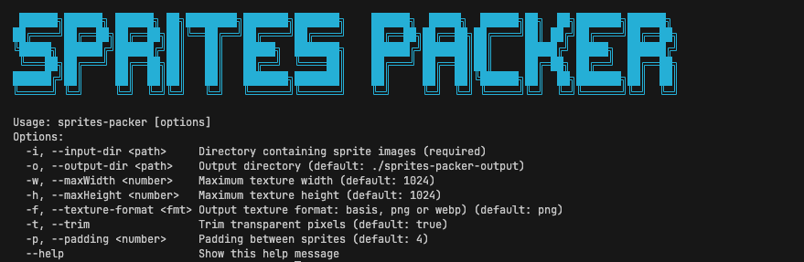

# SpritesPacker

A lightweight and efficient Node.js tool for generating texture atlases from image collections with out-of-the-box support for GPU Compressed textures.
SpritePacker helps game developers and web designers optimize performance by combining multiple images into a single texture atlas with corresponding metadata.


## Features

-   **Intelligent Packing**: Uses the MaxRects algorithm to organize sprites in the smallest possible atlas efficiently
-   **GPU-Optimized Textures**: Support for Basis Universal supercompressed GPU format alongside PNG and WebP
-   **Command-Line Interface**: Easy-to-use CLI tool for quick sprite packing
-   **Low Dependencies**: We value a minimalist approach to dependencies, using only what’s strictly necessary.

## GPU Compressed Texture Support

SpritePacker offers Basis Universal texture compression, a "universal" GPU texture encoding format that can be transcoded to various GPU-specific formats:

### Advantages of the Basis Universal Format

-   **Cross-platform compatibility**: Supports nearly all modern GPUs and platforms
-   **Dramatically reduced file sizes**: 2-5x smaller than PNG with minimal quality loss
-   **Reduced memory usage**: Textures remain compressed in GPU memory, decreasing VRAM usage
-   **Faster loading times**: Smaller file sizes mean quicker downloads and startup
-   **Lower bandwidth consumption**: Essential for web, mobile games, and applications
-   **Efficient GPU rendering**: Optimized for hardware-accelerated performance

### When to Use Basis Format

-   **Web and mobile games**: When bandwidth and memory constraints are critical
-   **AR/VR applications**: When performance requirements are high
-   **Large texture atlases**: When using high-resolution sprite sheets
-   **Games with many textures**: When VRAM memory becomes a bottleneck

## Usage

You can use SpritePacker either as a CLI tool or in your Node.js applications:

### Command-Line Interface (CLI)

SpritePacker includes a convenient command-line tool for quick texture atlas generation:



```bash
# Basic usage (in any directory)
sprites-packer -i ./images

# Specify output directory
sprites-packer -i ./images -o ./atlas

# Custom dimensions and format
sprites-packer -i ./images -w 2048 -h 2048 -f webp

# Full example with all options
sprites-packer -i ./images -o ./atlas -w 4096 -h 4096 -f basis -p 2 -t
```

### Node.js Library

You can also use SpritePacker programmatically in your Node.js applications:

```javascript
const { spritesPacker } = require("sprites-packer");
// Or using ES modules:
// import { spritesPacker } from 'sprites-packer';

// Basic usage
await spritesPacker({
    inputPath: "./images",
    outputPath: "./atlas",
    maxWidth: 2048,
    maxHeight: 2048,
    padding: 2,
    trim: true,
    textureFormat: "png", // 'png', 'webp', or 'basis'
});

// Advanced usage with path resolution
const path = require("path");

await spritesPacker({
    inputPath: path.resolve(__dirname, "assets/characters"),
    outputPath: path.resolve(__dirname, "dist/atlases"),
    maxWidth: 4096,
    maxHeight: 4096,
    padding: 4,
    trim: false,
    textureFormat: "basis", // Basis Universal format for cross-platform GPU textures
});
```

### Configuration Options

| Option          | Type    | Description                                                                                                                                           |
| --------------- | ------- | ----------------------------------------------------------------------------------------------------------------------------------------------------- |
| `inputPath`     | string  | Directory containing source images                                                                                                                    |
| `outputPath`    | string  | Directory where atlas and metadata will be saved                                                                                                      |
| `maxWidth`      | number  | Maximum width of generated atlas (min: 128px)                                                                                                         |
| `maxHeight`     | number  | Maximum height of generated atlas (min: 128px)                                                                                                        |
| `padding`       | number  | Number of pixels between sprites                                                                                                                      |
| `trim`          | boolean | When true, removes transparent borders around sprites                                                                                                 |
| `textureFormat` | string  | Output format:<br>- "png": Standard PNG with transparency<br>- "webp": WebP for better compression<br>- "basis": Basis Universal GPU-optimized format |

## Output Files

SpritePacker generates two files:

1. An image file (`.png`, `.webp` or `.basis`) containing the packed texture atlas
2. A `.json` file with metadata about each sprite's position and dimensions

Example JSON output:

```json
{
    "frames": {
        "character1.png": {
            "frame": { "x": 0, "y": 0, "w": 64, "h": 64 },
            "rotated": false,
            "trimmed": true,
            "spriteSourceSize": { "x": 2, "y": 3, "w": 64, "h": 64 },
            "sourceSize": { "w": 68, "h": 70 }
        },
        "character2.png": {
            "frame": { "x": 68, "y": 0, "w": 32, "h": 32 },
            "rotated": false,
            "trimmed": false,
            "spriteSourceSize": { "x": 0, "y": 0, "w": 32, "h": 32 },
            "sourceSize": { "w": 32, "h": 32 }
        }
    },
    "meta": {
        "image": "atlas.webp",
        "format": "RGBA8888",
        "size": { "w": 2048, "h": 2048 },
        "scale": 1
    }
}
```

## Requirements

-   Node.js 14 or higher

## Contributing

Contributions are welcome! Please feel free to submit a Pull Request.

1. Fork the repository
2. Create your feature branch (`git checkout -b feature/amazing-feature`)
3. Commit your changes (`git commit -m 'Add some amazing feature'`)
4. Push to the branch (`git push origin feature/amazing-feature`)
5. Open a Pull Request

## License

This project is licensed under the MIT License - see the LICENSE file for details.

## Acknowledgments

-   [sharp](https://github.com/lovell/sharp) for powerful image processing
-   [maxrects-packer](https://github.com/soimy/maxrects-packer) for efficient sprite packing
-   [basis-universal](https://github.com/BinomialLLC/basis_universal) for GPU texture compression
